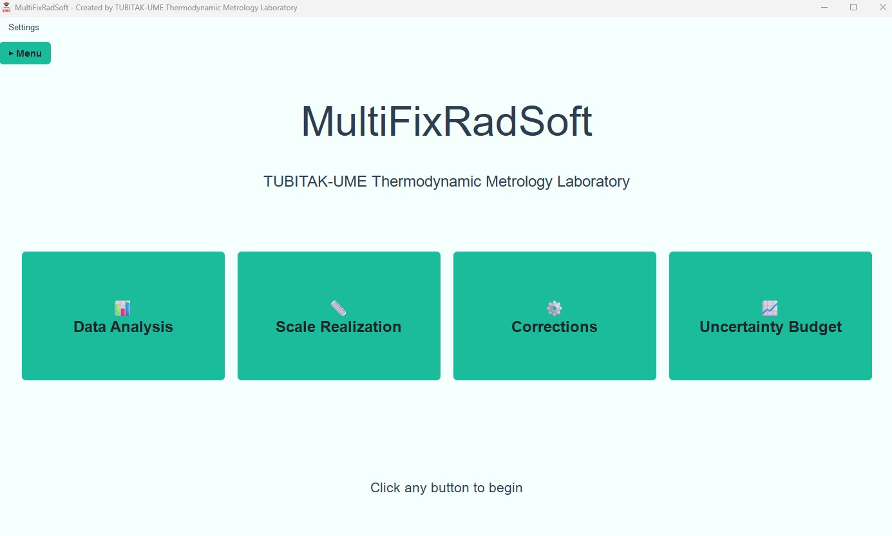

<div align="center">


# MultiFixRadSoft

**Multi-Fixed-Point Radiation Thermometry Analysis Software**

Developed by [TUBITAK-UME Thermodynamic Metrology Laboratory](https://www.ume.tubitak.gov.tr/en/physics-group-laboratories/#termodinamik)

[](LICENSE)
[](https://www.python.org/downloads/)
[](CHANGELOG.md)

</div>

---

## Overview

MultiFixRadSoft is an open-source desktop GUI application for relative primary radiation thermometry (RPRT), developed at TÜBİTAK UME in accordance with the Mise-en-Pratique for the kelvin (MeP-K). It covers the complete measurement workflow in a single tool — from raw time–temperature–signal data through melting-plateau analysis, instrument corrections, Sakuma–Hattori scale fitting, and full GUM-compliant uncertainty propagation.

The software supports ITS-90 metal fixed points and metal–carbon / metal-carbide–carbon eutectic high-temperature fixed points (HTFPs) , with flexible calibration schemes from a single fixed point up to N points. The software has been validated through comparison with manual analyses and published reference datasets. It is specifically designed to facilitate the adoption of primary thermodynamic temperature realization methods within the redefined SI framework by reducing the mathematical and computational burden on emerging National Metrology Institutes (NMIs), Designated Institutes (DIs), and industrial laboratories.



---

## Features

| Module | Capabilities |
|---|---|
| **Data Analysis** | Load T–S data; Kalman / Savitzky-Golay / Moving-Average filtering; derivative computation; Point of Inflection (POI) via CCT WG5, polynomial, or selective-fit methods; liquidus temperature calculation |
| **Scale Realization** | Sakuma-Hattori fitting (1–N fixed points); ITS-90 scale realization; T↔S conversion; σ / λ calculation from spectral data |
| **Corrections** | Size-of-Source Effect (SSE) with ring-by-ring integration; emissivity correction (Planck's law); temperature-drop correction; linearity analysis |
| **Uncertainty Budget** | Multi-component uncertainty propagation; sensitivity coefficients for 1, 2, and N-point cases; export to calibration certificate (JSON / CSV) |
| **Themes** | 7 built-in themes (Nord Dark, Dracula, Monokai, One Dark, Light, Soft Light, Mint Light) + live custom theme editor |
| **Interactive Plots** | Right-click context menus; zoom / pan / span selection; export to PNG / SVG / PDF / CSV; grid, font, axis, and legend customisation |

---

## Requirements

- **Python** 3.9 or newer
- Dependencies (installed automatically — see [requirements.txt](requirements.txt)):

| Package | Minimum version |
|---|---|
| PySide6 | 6.5.0 |
| NumPy | 1.24.0 |
| SciPy | 1.10.0 |
| pandas | 2.0.0 |
| Matplotlib | 3.7.0 |

---

## Installation

```bash
# 1. Clone the repository
git clone https://github.com/Thermodynamics-UME/MultiFixRadSoft.git
cd MultiFixRadSoft

# 2. (Recommended) Create and activate a virtual environment
python -m venv venv
venv\Scripts\activate        # Windows
# source venv/bin/activate   # macOS / Linux

# 3. Install dependencies
pip install -r requirements.txt
```

---

## Usage

```bash
python main.py
```

The application opens on the home page. Click any of the four module buttons to navigate to Data Analysis, Scale Realization, Corrections, or the Uncertainty Budget.

### Loading example data

Ready-to-use datasets are provided in `Example_data/`:

```
Example_data/
├── SensorData.csv                 # Example raw sensor data (Data Analysis)
├── Signal-Temperature/            # Fixed-point T–S files (LP5 pyrometer)
│   ├── LP5_Fe-C.txt
│   ├── LP5_Pd-C.txt
│   ├── LP5_Ru-C.txt
│   ├── LP5_WC-C.txt
│   └── LP5_WC-C-K.txt
├── Scale Realization/             # Scale realization example dataset
│   └── T-S.txt
├── SSE/                           # Size-of-source scan and fit data
│   ├── Scan_WCC.txt
│   └── sse_lp5.txt
└── Linearity/                     # Linearity correction data
    └── linearity.csv
```

---

## Project Structure

```
MultiFixRadSoft/
├── main.py                        # Main entry point
├── requirements.txt               # Runtime dependencies
├── LICENSE                        # MIT License
├── CHANGELOG.md                   # Version history
├── CONTRIBUTING.md                # Contribution guide
├── CITATION.cff                   # Citation metadata
├── src/                           # Source package
│   ├── theme_manager.py           # Theme system & custom theme editor
│   ├── plot_canvas.py             # Interactive matplotlib canvas
│   ├── uncertainty.py             # Uncertainty propagation core
│   ├── UncertaintyFunctions.py    # Sensitivity coefficient functions
│   ├── RunUncertainty.py          # Calibration fitting & uncertainty engine
│   ├── safe_math.py               # AST-based safe math expression parser
│   ├── UncertaintyWidget.py       # Fixed-point uncertainty UI widget
│   ├── UncertaintyTabWidget.py    # Uncertainty budget tab UI
│   ├── addFixedPoint.py           # Add fixed point dialog
│   ├── GraphsOptions.py           # Graph options dialog
│   ├── ExportSettings.py          # Export settings dialog
│   └── pages/
│       ├── home_page.py
│       ├── data_analysis_page.py
│       ├── scale_realization_page.py
│       ├── corrections_page.py
│       └── uncertainty_budget_page.py
├── models/                        # Default configuration files (JSON)
├── Fixed Points/                  # Fixed-point reference data (JSON)
├── Example_data/                  # Example datasets
└── img/                           # Application images / icons
```

---

## License

This project is licensed under the **MIT License** — see [LICENSE](LICENSE) for details.

---

## Citation

If you use MultiFixRadSoft in your research, please cite the accompanying paper:

> Ertürk, M.; Karabulut, M.; Kadı, Ö.F.; Gözönünde, C.; Broberg, P.; Olsen, Å.A.F.; Nasibli, H. MultiFixRadSoft: A Comprehensive Tool for Primary Relative Radiometric Scale Realization in Radiation Thermometry. *Sensors* **2026**, *26*, 2489. DOI: [10.3390/s26082489](https://doi.org/10.3390/s26082489)

[](https://doi.org/10.3390/s26082489)

A machine-readable citation file is available at [CITATION.cff](CITATION.cff).

---

## Funding

This software was developed within the project **"Improving the Realisation of the Kelvin by Multiple Fixed Point Radiation Thermometry"** (22RPT03-MultiFixRad), which has received funding from the European Partnership on Metrology, co-financed from the European Union's Horizon Europe Research and Innovation Programme and by the Participating States.

Further information about the project is available at [https://projects.lne.eu/jrp-multifixrad/](https://projects.lne.eu/jrp-multifixrad/).

---

## Contributing & Feedback

MultiFixRadSoft is a community-driven project and we welcome all contributions. Whether you have found a bug, have a feature suggestion, or want to improve the code, your input is valuable.

- **Bug reports & feature requests:** Open an issue on GitHub describing what you encountered or what you would like to see.
- **Pull requests:** Contributions via pull requests are warmly welcomed. Please describe your changes clearly in the PR description.
- **Direct contact:** If you prefer, you can reach us directly at the e-mail address below.

---

## Contact

**TUBITAK-UME Thermodynamic Metrology Laboratory**
✉ [ume.g1td_yazilim@tubitak.gov.tr](mailto:ume.g1td_yazilim@tubitak.gov.tr)

